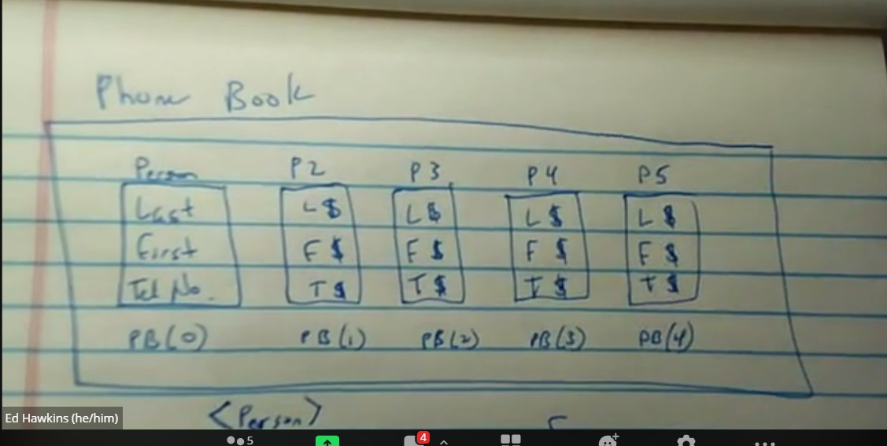
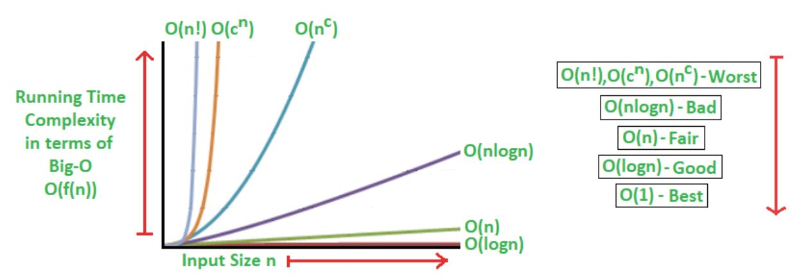

### Collaborators: Ed Hawkins, Janna Lin, Elizabeth Rechtin, & Greg Sciame

* Data Structure design challenge: Phonebook...

## Main Data Structure Chosen: Array List (data type: person objects using an array[])

* The PhoneBook ArrayList will contain person objects, & within each person object the LastName, FirstName & PhoneNumber will be Strings stored in regular arrays[], since each person object only has 3 Strings and the amount of data in each person object won't grow or shrink so modifying the array[] size will not be a problem

* The phonebook database will need a find() method (BINARY search... to keep runtime quick we will use a binary search since it's so much faster than most other search techniques with its logarithmic relationship, the inverse of exponential...so the computer will work quicker & smarter not harder, saving search time and keeping the phonebook user community satisfied 😎📞)

## For the add() method: 
  * RUNTIME: The add() method has a 'Fair' runtime of O(n)...WHEN WE ARE FINDING THE INDEX
  
  * we would need to modify the binary search to compare two numbers: look at the middle & the middle +1 ....if both values are higher or lower then we know which half of the PhoneBook data to drop, and continue searching to find where to add the new person

     * IF the list has 0 person objects, add the item

     * IF the list only has 1 item, determine where the new person goes based on alphabetical ordering

    * Based on the above, once we know WHERE (index) to add, then we can use the built-in add() method to add at the index found with this modified binary search

## For find():
  * RUNTIME: The find() method has a 'Good' runtime of O(logn)
  * we would use binarySearch to return the index of exact person object that it's looking for
  * If the person object doesn't exist, we would return null ("This person doesn't exist in this phoneBook")

## For remove():
  * RUNTIME: The remove() method will have a 'Fair' runtime of O(n), similar to the add() method

## For printList():
  *  RUNTIME: The printList() method will have a 'Bad' runtime of O(nlogn), since each array object in the ArrayList will need to be accessed and printed...but this can't be avoided for a method like printList() that needs access to ALL of the data.