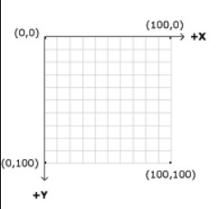

| Name | Partner |
| ----------- | ----------- |
|// | // |

## Your code:


```p5.js
function setup() {
  createCanvas(    ,    ); //add the size of the canvas
}

function draw() {
  background(220);
  
  //write your code for rect() here

  
}
```

## Your rectangle: 

